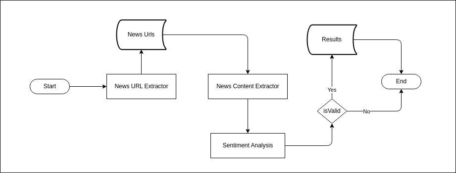

## Software Design Document

### 1. Introduction

- **1.1. Purpose**

    The News Analyzer System aims to provide a tool for analyzing news articles and understanding their potential impact on Sri Lankan society. It uses the Google AI Platform (PALM) to categorize news articles based on sentiment and relevance to various social, economic, and political spheres.

- **1.2. Scope**

    This SDD defines the design of the News Analyzer system, encompassing the following functionalities
    - News URL extraction from a CSV file
    - Web scraping to retrieve news content
    - Sentiment analysis using PALM API
    - Categorization of news articles based on sentiment and impact
    - Output of results to a CSV file.

- **1.3. System Overview**

    The News Analyzer system is comprised of two Python scripts:
    - **[news_analyzer.py](../news_analyzer.py)** - Performs the core analysis tasks, including sentiment analysis, categorization, and result output.
    - **[news_url_extracter.py](../news_url_extracter.py)** - Extracts news URLs from a specified source.

### 2. System Architecture

- **2.1. Data Flow Diagram**

    

    The data flow diagram illustrates the flow of data within the News Analyzer system. The process begins with the extraction of news URLs from a CSV file or a specified source. The news content is then retrieved using web scraping techniques. The content is analyzed for sentiment using the PALM API, and the news articles are categorized based on their impact. The results are stored in a CSV file for further analysis.


- **2.2. Component Descriptions**

    * **[news_analyzer.py](../news_analyzer.py)**
        * **Input :** News article URLs from a CSV file.
        * **Processing :**
            * Reads news URLs from the CSV file.
            * Retrieves news content using web scraping.
            * Performs sentiment analysis using PALM API.
            * Categorizes news articles based on sentiment and impact.
            * Writes results to a CSV file.
        * **Output :** A CSV file containing analysis results.

    * **[news_url_extracter.py](../news_url_extracter.py)**
        * **Input :** A specified news source (e.g., website URL).
        * **Processing :** Uses web scraping techniques to extract news article URLs.
        * **Output :** A CSV file containing extracted news URLs.

- **2.3. User Interface**

    The News Analyzer system currently operates in a command-line interface (CLI).  Users interact with the system by providing the necessary input file and executing the script. Future development may include a graphical user interface (GUI).

- **2.4. Data Storage**

    The system utilizes CSV files to store both input (news URLs) and output (analysis results).

### 3. System Design

- **3.1. Module Design**

    The News Analyzer system is structured into two main Python scripts:
    1. [news_analyzer.py](../news_analyzer.py)
    2. [news_url_extracter.py](../news_url_extracter.py)

    Each script contains specific modules that handle different aspects of the news analysis process.

    **[news_analyzer.py](../news_analyzer.py)**

    This script orchestrates the core analysis process, handling tasks like reading news URLs, retrieving content, performing sentiment analysis, and outputting results. It is structured as follows:

* **Function `reading_csv_to_get_url()`:** 

    This function reads news article URLs from a CSV file.

   ```python
   def reading_csv_to_get_url() -> list:
       """Reads a CSV file to extract titles and URLs."""
       with open("news_url_list.csv", "r", encoding="utf-8") as file:
           url_list = []
           csv_reader = csv.DictReader(file)
           for row in csv_reader:
               url = row.get("post_url")
               if url:
                   url_list.append(url)
       return url_list
   ```

* **Function `get_the_content()`:** 

    This function uses web scraping to fetch the content of a news article from a given URL.

   ```python
   def get_the_content(url: str) -> str:
       """Gets the content of a webpage given its URL."""
       response = requests.get(url)
       soup = bs4.BeautifulSoup(response.text, "html.parser")
       content = soup.find("div", class_="new_details")  # Example selector
       if content:
           paragraphs = content.find_all("p")
           content_text = ""
           for paragraph in paragraphs:
               content_text += paragraph.text
           return content_text
       else:
           return "No content found on the page."
   ```

* **Function `extract_news_title()`:** 

    This function extracts the news title from the HTML content of a news article.

   ```python
   def extract_news_title(response_text: str) -> str:
       """Extracts the news title from HTML content."""
       soup = bs4.BeautifulSoup(response_text, "html.parser")
       title = soup.find("h1", class_="top_stories_header_news") # Example selector
       if title:
           return title.text
       else:
           return "No title found on the page."
   ```

* **Function `get_the_palm_response()`:** 

    This function sends a request to the PALM API for sentiment analysis. It takes the news title, content, and a question as input and returns the PALM API response.

   ```python
   def get_the_palm_response(title: str, content: str, defaults: dict, question: str) -> str:
       """Gets a response from the PALM API for given title, content, and a question."""
       completion = palm.generate_text(
           prompt=PROMPT.format(title=title, content=content, question=question),
           **defaults
       )
       return completion.result
   ```

* **Function `analyze_a_news()`:** 

    This function orchestrates the analysis of a single news article. It retrieves the content, performs sentiment analysis, and categorizes the article based on the PALM response.

   ```python
   def analyze_a_news(url: str, defaults: dict, question_for_main: str,question_for_positive:str,question_for_negative:str) -> dict:
       """Analyzes a news article from a given URL using PALM API."""
       response = requests.get(url)
       title = extract_news_title(response.text)
       content = get_the_content(url)
       # ... (rest of the function logic)
   ```

* **Function `writing_to_result_csv()`:** 

    This function writes the analysis results to a CSV file.

   ```python
   def writing_to_result_csv(analysis: dict) -> None:
       """Writes analysis results to a CSV file."""
       with open("result.csv", "a", newline="", encoding="utf-8") as file:
           csv_writer = csv.DictWriter(file, fieldnames=["title", "palm_response", "palm_sub_response", "url"])
           csv_writer.writerow(analysis)
   ```

* **Function `analyzer()`:** 

    This is the main function of the [news_analyzer.py](../news_analyzer.py) script. It orchestrates the entire analysis process by iterating through news URLs, analyzing each article, and writing results to the output CSV file.

   ```python
   def analyzer():
       """Analyzes news articles from a CSV file and saves results to a new CSV file."""
       url_list = reading_csv_to_get_url()
       print("Total news : ", len(url_list))
       for url in url_list:
           print("**********************************************")
           analysis = analyze_a_news(url, defaults=DEFAULTS_FOR_PALM, question_for_main=QUESTION_FOR_MAIN_CATEGORIES,question_for_positive=QUESTION_FOR_POSITIVE_CATEGORIES,question_for_negative=QUESTION_FOR_NEGATIVE_CATEGORIES)
           writing_to_result_csv(analysis)
           print("Currently completed : ", url_list.index(url) + 1, " out of ", len(url_list))
   ```

    **[news_url_extracter.py](../news_url_extracter.py)**

    This script focuses on extracting news article URLs from a specified source. It may contain several functions depending on the extraction method and the source of the news articles. Here's a possible structure with examples:

* **Function `extracter()`:** 

    This function orchestrates the URL extraction process. It takes the source of the news articles (e.g., a website URL) as input and calls other functions to perform the actual extraction.

   ```python
   def extracter(source_url: str) -> None:
       """Extracts news URLs from a specified source."""
       # 1. Fetch the source HTML content
       response = requests.get(source_url)
       soup = bs4.BeautifulSoup(response.text, "html.parser")

       # 2. Identify news article elements 
       news_articles = soup.find_all("div", class_="article") # Example selector
       if not news_articles: 
           print(f"No news articles found on {source_url}")
           return

       # 3. Extract URLs from the identified elements
       urls = [article.find("a")["href"] for article in news_articles]

       # 4. Write the URLs to the CSV file
       with open("news_url_list.csv", "w", newline="", encoding="utf-8") as file:
           csv_writer = csv.DictWriter(file, fieldnames=["post_url"])
           csv_writer.writeheader()
           for url in urls:
               csv_writer.writerow({"post_url": url})

       print(f"Extracted {len(urls)} news URLs from {source_url}.")
   ```

* **Function `extract_from_website(url: str)`:** 

    This function might be used to extract URLs specifically from a website, potentially by using selectors to identify news article elements within the HTML structure.

   ```python
   def extract_from_website(url: str) -> list:
       """Extracts URLs from a website."""
       response = requests.get(url)
       soup = bs4.BeautifulSoup(response.text, "html.parser")
       urls = []
       # ... (Logic for identifying news articles based on HTML structure)
       return urls 
   ```

* **Function `extract_from_rss_feed(feed_url: str)`:** 

    This function could be used to extract URLs from an RSS feed, making use of RSS feed parsing libraries (e.g., `feedparser`).

   ```python
   def extract_from_rss_feed(feed_url: str) -> list:
       """Extracts URLs from an RSS feed."""
       import feedparser
       feed = feedparser.parse(feed_url)
       urls = [entry["link"] for entry in feed.entries]
       return urls
   ```

* **Function `extract_from_api(api_endpoint: str, params: dict) -> list:`:** 

    This function might be used to extract URLs from an API that provides news data.

   ```python
   def extract_from_api(api_endpoint: str, params: dict) -> list:
       """Extracts URLs from an API endpoint."""
       response = requests.get(api_endpoint, params=params)
       if response.status_code == 200:
           data = response.json()
           urls = [article["url"] for article in data["articles"]]
           return urls
       else:
           return []
   ```

- **3.2. Data Structures**

    * **news_url_list.csv** - Contains news article titles and URLs.
    * **result.csv** - Contains analysis results, including news title, URL, sentiment analysis response, and category.

- **3.3. Algorithms**

    * **Web Scraping:** The system uses the [BeautifulSoup](https://www.crummy.com/software/BeautifulSoup/) library to parse HTML content and extract news article URLs and content.
    * **Sentiment Analysis:** The system utilizes the PALM API to perform sentiment analysis on news article content.
    * **Categorization:** The system applies pre-defined rules and logic to categorize news articles based on sentiment and relevance to various social, economic, and political spheres.

- **3.4. Security Considerations**

    The system does not handle sensitive user data. However, it is important to consider the following security aspects:

    * **PALM API Key Security:** The PALM API key should be stored securely and not publicly accessible.
    * **Input Validation:** Input data (URLs) should be validated to prevent potential malicious input.

### 4. System Testing

- **4.1. Test Cases**

    * **Valid News URLs :** Test with a variety of valid news article URLs to ensure accurate content extraction and sentiment analysis.
    * **Invalid News URLs :** Test with invalid or non-existent URLs to ensure proper error handling.
    * **Sentiment Analysis Accuracy :** Test with articles known to have different sentiments (positive, negative, neutral) to verify the accuracy of the PALM API responses.
    * **Categorization Logic :** Test with articles representing different social, economic, and political themes to validate the categorization logic.
    * **Output Formatting :** Test the output CSV file to ensure correct formatting and content.


### 5. System Deployment

- **5.1. Deployment Environment**

    The system can be deployed on a Linux server or a cloud platform like AWS or Google Cloud Platform.

- **5.2. Deployment Steps**

    1. **Install dependencies** 
    
        Ensure all required Python libraries are installed on the deployment environment.
    2. **Configure PALM API key** 
    
        Set the `PALM_API_KEY` variable in the `.env` to the obtained API key.
    3. **Deploy the scripts** 
    
        Copy the [news_analyzer.py](../news_analyzer.py)
 and [news_url_extracter.py](../news_url_extracter.py) scripts to the deployment server.
    4. **Set up a cron job** 
    
        If the system needs to run automatically, configure a cron job to execute the main script [main.py](../main.py) at regular intervals.
    5. **Test the deployment** 
    
        Run the scripts on the deployment environment to ensure everything works as expected.

### 6. Maintenance

- **6.1. Monitoring**

    * **Log files :** Regularly check log files for errors or unexpected behavior.
    * **System performance :** Monitor CPU usage, memory consumption, and response times.

- **6.2. Upgrades**

    * **PALM API updates :** Update the PALM API library and configuration as needed.
    * **Web scraping changes :** Adjust web scraping code if target news website structures change.


### 7. Conclusion

This SDD provides a comprehensive design for the News Analyzer system. The system is designed to be modular, extensible, and adaptable to future enhancements.  The project provides a valuable tool for understanding the impact of news on Sri Lankan society and can be further enhanced to provide more sophisticated analysis and insights.